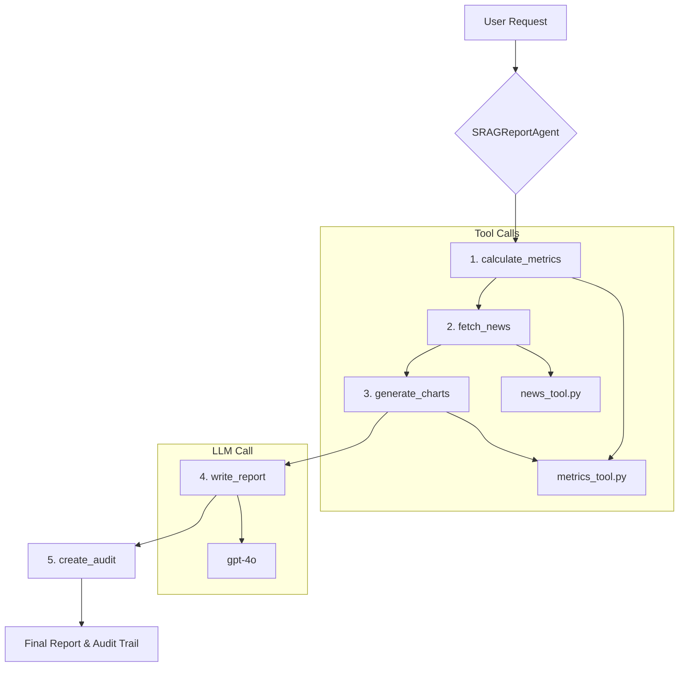

# SRAG Analytics - AI-Powered Healthcare Analytics

> **Automated SRAG (Severe Acute Respiratory Syndrome) analytics using LangGraph agents, OpenAI, and DATASUS data**

## 📋 Table of Contents

- [Overview](#overview)
- [Architecture](#architecture)
- [Features](#features)
- [Prerequisites](#prerequisites)
- [Installation](#installation)
- [Configuration](#configuration)
- [Usage](#usage)
- [API Documentation](#api-documentation)
- [Governance & Security](#governance--security)
- [Development](#development)
- [Project Structure](#project-structure)
- [License](#license)

## 🚀 Overview

This project implements an AI-powered analytics system for SRAG (Síndrome Respiratória Aguda Grave) data from Open DATASUS. It uses **LangGraph agents** to orchestrate:

1. **SQL queries** (with safety guardrails)
2. **Real-time news retrieval** (Tavily Search)
3. **RAG over data dictionary** (pgvector)
4. **Automated report generation**

### Key Metrics Calculated

1. **Taxa de aumento de casos** (Case increase rate)
2. **Taxa de mortalidade** (Mortality rate)
3. **Taxa de ocupação de UTI** (ICU occupancy rate)
4. **Taxa de vacinação** (Vaccination rate)

### Charts Provided

- Daily cases (last 30 days)
- Monthly cases (last 12 months)

## 🏗️ Architecture

The system follows a **microservices architecture** with:

- **PostgreSQL** (with pgvector) for data storage and vector search
- **FastAPI backend** exposing LangGraph agents via REST API
- **Streamlit frontend** for interactive dashboards
- **Docker containers** for backend and database

### Agent Workflow

