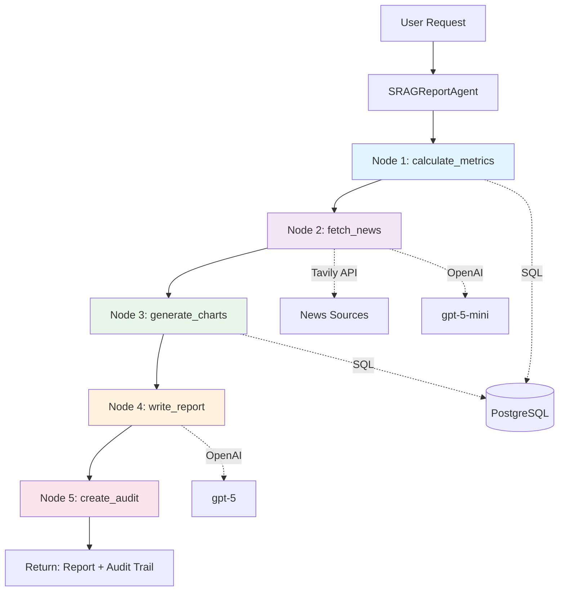

# SRAG Analytics - AI-Powered Healthcare Analytics

> **Automated SRAG (Severe Acute Respiratory Syndrome) analytics using LangGraph agents, OpenAI, and DATASUS data**

[](https://www.python.org/downloads/)
[](https://github.com/langchain-ai/langgraph)
[](https://fastapi.tiangolo.com/)
[](https://streamlit.io/)

## 📋 Table of Contents

- [Overview](#overview)
- [Architecture](#architecture)
- [Features](#features)
- [Prerequisites](#prerequisites)
- [Installation](#installation)
- [Configuration](#configuration)
- [Usage](#usage)
- [API Documentation](#api-documentation)
- [Governance & Security](#governance--security)
- [Development](#development)
- [Project Structure](#project-structure)
- [License](#license)

## 🚀 Overview

This project implements an AI-powered analytics system for SRAG (Síndrome Respiratória Aguda Grave) data from Open DATASUS. It uses **LangGraph agents** to orchestrate:

1. **SQL queries** (with safety guardrails)
2. **Real-time news retrieval** (Tavily Search)
3. **RAG over data dictionary** (pgvector)
4. **Automated report generation**

### Key Metrics Calculated

1. **Taxa de aumento de casos** (Case increase rate)
2. **Taxa de mortalidade** (Mortality rate)
3. **Taxa de ocupação de UTI** (ICU occupancy rate)
4. **Taxa de vacinação** (Vaccination rate)

### Charts Provided

- Daily cases (last 30 days)
- Monthly cases (last 12 months)

## 🏗️ Architecture

The system follows a **microservices architecture** with:

- **PostgreSQL** (with pgvector) for data storage and vector search
- **FastAPI backend** exposing LangGraph agents via REST API
- **Streamlit frontend** for interactive dashboards
- **Docker containers** for backend and database

### Agent Workflow (LangGraph)

The system uses **LangGraph** to orchestrate a multi-step agentic workflow. Each node performs specific operations and passes state to the next node.



#### Node Descriptions

**1. `calculate_metrics` Node**
- **Purpose**: Computes 4 core SRAG metrics from DATASUS database
- **Calls**: `metrics_tool.calculate_all_metrics(days, state_filter)`
- **Operations**:
  - Case increase rate (current vs previous period)
  - Mortality rate (deaths / total cases)
  - ICU occupancy rate (ICU admissions / hospitalizations)
  - Vaccination rate (vaccinated cases / total cases)
- **Output**: Dictionary with all 4 metrics + metadata

**2. `fetch_news` Node**
- **Purpose**: Retrieves recent Portuguese news about SRAG
- **Calls**:
  - `news_tool.search_srag_news(days, max_results=10)` - Tavily search API
  - `news_tool._extract_date_with_llm(title, content)` - GPT-5-mini for date extraction
- **Operations**:
  - Searches Brazilian news domains (G1, Folha, CNN Brasil, Fiocruz, etc.)
  - Filters by SRAG-related keywords
  - Extracts publication dates using LLM when Tavily doesn't provide them
  - Validates dates are within requested time window
- **Output**: News citations with title, URL, date, and content preview

**3. `generate_charts` Node**
- **Purpose**: Prepares time-series data for frontend visualization
- **Calls**:
  - `metrics_tool.get_daily_cases_chart_data(days)`
  - `metrics_tool.get_monthly_cases_chart_data(months=12)`
- **Operations**:
  - Queries daily metrics for trend analysis
  - Aggregates monthly data for 12-month overview
- **Output**: Chart data arrays for daily and monthly visualizations

**4. `write_report` Node**
- **Purpose**: Generates human-readable report in Portuguese
- **Calls**: `ChatOpenAI(model="gpt-5").invoke(messages)`
- **Operations**:
  - Synthesizes metrics and news context
  - Produces structured markdown report (~500 words)
  - Sections: Executive Summary, Metrics Analysis, News Context, Conclusion
- **Output**: Complete Portuguese SRAG report

**5. `create_audit` Node**
- **Purpose**: Creates audit trail for transparency and debugging
- **Operations**:
  - Captures all state transitions and messages
  - Logs SQL queries executed
  - Saves full execution log to `/logs` directory
  - Filters messages for user-facing audit trail
- **Output**: JSON audit trail with execution metadata

#### State Management

The workflow uses a **reducer pattern** for message accumulation:
```python
class ReportState(TypedDict):
    messages: Annotated[Sequence[BaseMessage], add]  # Accumulated across nodes
    days: int
    state_filter: Optional[str]
    metrics: Optional[Dict[str, Any]]
    news_context: Optional[str]
    chart_data: Optional[Dict[str, Any]]
    final_report: Optional[str]
    audit_trail: Optional[Dict[str, Any]]
```

Each node receives the current state, performs its operations, updates the state, and passes it to the next node via edges defined in the graph.


#### Future Capabilities

The system includes `sql_tool.py` - a safe SQL query tool designed for future user-driven data exploration features. Currently **not used in production** for security and reliability. See [SQL Tool Implementation Guide](docs/SQL_TOOL_IMPLEMENTATION_GUIDE.md) for details on enabling natural language database queries.
