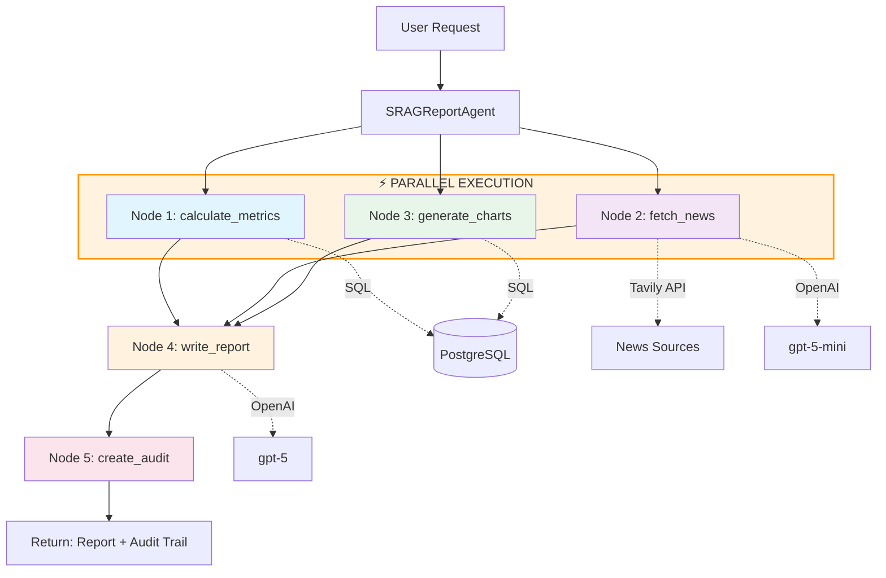

# SRAG Analytics - AI-Powered Healthcare Analytics

> **Automated SRAG (Severe Acute Respiratory Syndrome) analytics using LangGraph agents, OpenAI, and DATASUS data**

[](https://www.python.org/downloads/)
[](https://github.com/langchain-ai/langgraph)
[](https://fastapi.tiangolo.com/)
[](https://streamlit.io/)

## Table of Contents

- [Overview](#overview)
- [Architecture](#architecture)
- [Features](#features)
- [Prerequisites](#prerequisites)
- [Installation](#installation)
- [Configuration](#configuration)
- [Usage](#usage)
- [API Documentation](#api-documentation)
- [Governance & Security](#governance--security)
- [Development](#development)
- [Project Structure](#project-structure)
- [License](#license)

## Overview

This project implements an AI-powered analytics system for SRAG (Síndrome Respiratória Aguda Grave) data from Open DATASUS. It uses **LangGraph agents** to orchestrate:

1. **SQL queries** (with safety guardrails)
2. **Real-time news retrieval** (Tavily Search)
3. **RAG over data dictionary** (pgvector)
4. **Automated report generation**

### Key Metrics Calculated

1. **Taxa de aumento de casos** (Case increase rate)
2. **Taxa de mortalidade** (Mortality rate)
3. **Taxa de ocupação de UTI** (ICU occupancy rate)
4. **Taxa de vacinação** (Vaccination rate)

### Charts Provided

- Daily cases (last 30 days)
- Monthly cases (last 12 months)

## Architecture

The system follows a **microservices architecture** with:

- **PostgreSQL** (with pgvector) for data storage and vector search
- **FastAPI backend** exposing LangGraph agents via REST API
- **Streamlit frontend** for interactive dashboards
- **Docker containers** for backend and database

### Agent Workflow (LangGraph)

The system uses **LangGraph** to orchestrate a multi-step agentic workflow with **parallel execution** for improved performance. The first three data-gathering nodes run concurrently (fan-out), then converge (fan-in) at the report writing stage.



#### Node Descriptions

##### ⚡ Parallel Phase (Fan-out from START)

**1. `calculate_metrics` Node** — *runs in parallel*
- **Purpose**: Computes 4 core SRAG metrics from DATASUS database
- **Calls**: `metrics_tool.calculate_all_metrics(days, state_filter)`
- **Operations**:
  - Case increase rate (current vs previous period)
  - Mortality rate (deaths / total cases)
  - ICU occupancy rate (ICU admissions / hospitalizations)
  - Vaccination rate (vaccinated cases / total cases)
- **Output**: Dictionary with all 4 metrics + metadata

**2. `fetch_news` Node** — *runs in parallel*
- **Purpose**: Retrieves recent Portuguese news about SRAG
- **Calls**:
  - `news_tool.search_srag_news(days, max_results=10)` - Tavily search API
  - `news_tool._extract_date_with_llm(title, content)` - GPT-5-mini for date extraction
- **Operations**:
  - Searches Brazilian news domains (G1, Folha, CNN Brasil, Fiocruz, etc.)
  - Filters by SRAG-related keywords
  - Extracts publication dates using LLM when Tavily doesn't provide them
  - Validates dates are within requested time window
- **Output**: News citations with title, URL, date, and content preview

**3. `generate_charts` Node** — *runs in parallel*
- **Purpose**: Prepares time-series data for frontend visualization
- **Calls**:
  - `metrics_tool.get_daily_cases_chart_data(days)`
  - `metrics_tool.get_monthly_cases_chart_data(months=12)`
- **Operations**:
  - Queries daily metrics for trend analysis
  - Aggregates monthly data for 12-month overview
- **Output**: Chart data arrays for daily and monthly visualizations

##### Sequential Phase (Fan-in)

**4. `write_report` Node** — *waits for all parallel nodes*
- **Purpose**: Generates human-readable report in Portuguese
- **Calls**: `ChatOpenAI(model="gpt-5").invoke(messages)`
- **Operations**:
  - Receives merged state from all 3 parallel nodes
  - Synthesizes metrics and news context
  - Produces structured markdown report (~500 words)
  - Sections: Executive Summary, Metrics Analysis, News Context, Conclusion
- **Output**: Complete Portuguese SRAG report

**5. `create_audit` Node**
- **Purpose**: Creates audit trail for transparency and debugging
- **Operations**:
  - Captures all state transitions and messages
  - Logs SQL queries executed
  - Saves full execution log to `/logs` directory
  - Filters messages for user-facing audit trail
- **Output**: JSON audit trail with execution metadata

#### State Management

The workflow uses **custom reducers** to support parallel state updates. When multiple nodes run concurrently, LangGraph merges their outputs using these reducers:

```python
class ReportState(TypedDict):
    # Message accumulation (all nodes append)
    messages: Annotated[Sequence[BaseMessage], add]
    
    # Read-only config (keep first value from initialization)
    days: Annotated[int, keep_first]
    state_filter: Annotated[Optional[str], keep_first]
    
    # Parallel node outputs (merge dictionaries/lists)
    metrics: Annotated[Optional[Dict[str, Any]], merge_dicts]
    news_citations: Annotated[Optional[list], merge_lists]
    chart_data: Annotated[Optional[Dict[str, Any]], merge_dicts]
    
    # Sequential node outputs (keep latest)
    final_report: Annotated[Optional[str], keep_latest]
    audit_trail: Annotated[Optional[Dict[str, Any]], keep_latest]
```

**Fan-out/Fan-in Pattern**:
1. **Fan-out**: `START` branches to 3 parallel nodes simultaneously
2. **Parallel execution**: Each node returns only the fields it updates
3. **Fan-in**: LangGraph merges all outputs using reducers before `write_report`
4. **Sequential**: Report writing and audit creation run sequentially


#### Future Capabilities

The system includes `sql_tool.py` - a safe SQL query tool designed for future user-driven data exploration features. Currently **not used in production** for security and reliability. See [SQL Tool Implementation Guide](docs/SQL_TOOL_IMPLEMENTATION_GUIDE.md) for details on enabling natural language database queries.

## Prerequisites

Before starting, ensure you have:

- **Python 3.11+** - [Download here](https://www.python.org/downloads/)
- **uv** - Fast Python package manager - [Install guide](https://docs.astral.sh/uv/getting-started/installation/)
- **Docker & Docker Compose** - [Install Docker Desktop](https://www.docker.com/products/docker-desktop)
- **OpenAI API key** - [Get from OpenAI Platform](https://platform.openai.com/api-keys)
- **Tavily API key** - [Register at Tavily](https://tavily.com)

## Installation

### Quick Start (5 minutes)

```bash
# 1. Clone the repository
git clone <your-repo-url>
cd srag-analytics

# 2. Install uv (if not already installed)
# macOS/Linux
curl -LsSf https://astral.sh/uv/install.sh | sh

# Windows
powershell -c "irm https://astral.sh/uv/install.ps1 | iex"

# 3. Configure API keys
cp .env.example .env
# Edit .env and add your OPENAI_API_KEY and TAVILY_API_KEY

# 4. Start Docker services (backend + PostgreSQL)
docker-compose up -d

# 5. Install Python dependencies with uv
uv sync

# 6. Download all data from https://opendatasus.saude.gov.br/dataset/srag-2021-a-2024 and the PDF dictionary and put inside the /data folder

# 7. Ingest SRAG data (runs inside Docker container, takes 5-10 minutes)
docker-compose exec backend python -m backend.db.ingestion

# (optional) Parser for the future SQL generator agent
docker-compose exec backend python -m backend.db.dictionary_parser

# 8. Launch Streamlit frontend (runs outside container with uv)
uv run streamlit run frontend/app.py
```

Open [http://localhost:8501](http://localhost:8501) to access the dashboard.

**Note**: The frontend (Streamlit) runs on your local machine using `uv`, while the backend and database run in Docker containers.

### Detailed Setup

For step-by-step instructions with troubleshooting, see:
- **Quick Start**: [QUICKSTART.md](QUICKSTART.md) - Get running in under 10 minutes
- **Complete Setup**: [SETUP_INSTRUCTIONS.md](SETUP_INSTRUCTIONS.md) - Detailed installation guide

## Configuration

### Environment Variables

Create a `.env` file in the project root with the following configuration:

```env
# Required API Keys
OPENAI_API_KEY=sk-your-openai-key-here
TAVILY_API_KEY=tvly-your-tavily-key-here

# Database Configuration (default values shown)
DB_HOST=localhost
DB_PORT=5432
DB_NAME=srag_db
DB_USER=srag_user
DB_PASSWORD=srag_password

# API Configuration
API_HOST=0.0.0.0
API_PORT=8000
ENVIRONMENT=development

# LLM Configuration
LLM_MODEL=gpt-5              # Main model for report generation
LLM_MINI_MODEL=gpt-5-mini    # Auxiliary model for date extraction, SQL, chat
LLM_TEMPERATURE=0.3          # Slight creativity for natural report writing
LLM_MAX_TOKENS=2000

# News Search Configuration
TAVILY_MAX_RESULTS=10
NEWS_DAYS_DEFAULT=7
```

### Database Initialization

**Note**: Database tables are created automatically when the backend container starts. No manual initialization is required.

The system creates:
- `srag_cases` - Main SRAG data table
- `data_dictionary` - Data dictionary with embeddings
- `daily_metrics` - Materialized view for daily aggregates
- `monthly_metrics` - Materialized view for monthly aggregates

## Usage

### Generating Reports

#### Via Streamlit UI (Recommended)

1. Open [http://localhost:8501](http://localhost:8501)
2. Select a state filter (optional)
3. Adjust time period (default: 30 days)
4. Click **"Generate Report"** in the sidebar
5. Wait 30-60 seconds for AI processing
6. View:
   - **Metrics**: 4 key SRAG indicators
   - **Charts**: Daily and monthly case trends
   - **News**: Recent SRAG-related news with dates
   - **Report**: AI-generated analysis in Portuguese
7. Download audit trail JSON for transparency

#### Via API

```bash
# Generate a report for the last 30 days
curl -X POST http://localhost:8000/generate_report \
  -H "Content-Type: application/json" \
  -d '{"days": 30, "state_filter": null}'

# Generate a state-specific report
curl -X POST http://localhost:8000/generate_report \
  -H "Content-Type: application/json" \
  -d '{"days": 30, "state_filter": "SP"}'
```

### Available Endpoints

- **`GET /health`** - Health check
- **`POST /generate_report`** - Generate AI report
- **`POST /metrics`** - Get calculated metrics
- **`GET /sql/tables`** - List database tables
- **`GET /docs`** - Interactive API documentation (Swagger)

### Metrics Explained

All metrics are calculated using **DATASUS field definitions** from the official data dictionary. Below are the precise calculation methods and denominators used.

#### 1. Taxa de aumento de casos (Case Increase Rate)

**Definition**: Percentage change in cases between current and previous period.

**Formula**:
```
Δ% = ((casos_período_atual - casos_período_anterior) / casos_período_anterior) * 100
```

**Fields Used**:
- `DT_SIN_PRI` (Date of first symptoms) - Used to determine case period
- Count all cases where `DT_SIN_PRI` falls within the specified time window

**Denominator**: Total cases in the **previous period** (N days before current period)

**Example**: For a 30-day report:
- Current period: Last 30 days → 1,000 cases
- Previous period: 30 days before that → 800 cases
- Increase rate: `((1000 - 800) / 800) * 100 = 25%`

**UI Label**: `Taxa de aumento de casos — Δ% (últimos N dias vs N anteriores) por DT_SIN_PRI`

---

#### 2. Taxa de mortalidade (Mortality Rate)

**Definition**: Percentage of deaths among cases in the period **with a recorded outcome**.

**Formula**:
```
Taxa = (óbitos / casos_com_evolução_registrada) * 100
```

**Fields Used**:
- `EVOLUCAO` (Case outcome):
  - `1` = Cura (Recovery)
  - `2` = Óbito (Death)
  - `3` = Óbito por outras causas (Death by other causes)
  - `9` = Ignorado (Unknown)
- `DT_SIN_PRI` (Date of first symptoms) - For period filtering

**Calculation** (from pre-computed `daily_metrics` table):
```sql
SELECT
  SUM(new_deaths) AS total_deaths,
  SUM(cases_with_outcome) AS total_cases_with_outcome,
  (SUM(new_deaths)::float / SUM(cases_with_outcome)) * 100 AS mortality_rate
FROM daily_metrics
WHERE metric_date >= CURRENT_DATE - INTERVAL '30 days'
  AND state IS NULL  -- National totals (or filter by state)
```

Where `daily_metrics.cases_with_outcome` is pre-computed as:
```sql
-- During ingestion
SUM(CASE WHEN evolucao IN (1, 2) THEN 1 ELSE 0 END) AS cases_with_outcome
```

**Denominator**: Cases with recorded outcome (`EVOLUCAO IN (1, 2)`) — **not all cases in the period**

**Rationale**: Using all cases (including those still hospitalized or with unknown outcomes) would artificially lower the mortality rate. We only include cases with a final outcome (recovery or death) excluding unknown outcomes.

**UI Label**: `Taxa de mortalidade — óbitos (evolucao=2) ÷ casos com evolucao IN (1,2)`

---

#### 3. Taxa de ocupação de UTI (ICU Occupancy Rate)

**Definition**: Percentage of hospitalized cases that required ICU admission.

**Formula**:
```
Taxa = (casos_internados_em_UTI / casos_hospitalizados) * 100
```

**Fields Used**:
- `HOSPITAL` (Hospitalization status):
  - `1` = Sim (Yes)
  - `2` = Não (No)
  - `9` = Ignorado (Unknown)
- `UTI` (ICU admission):
  - `1` = Sim (Yes)
  - `2` = Não (No)
  - `9` = Ignorado (Unknown)
- `DT_SIN_PRI` (Date of first symptoms) - For period filtering

**Calculation**:
```sql
SELECT
  COUNT(*) FILTER (WHERE uti = 1) AS icu_cases,
  COUNT(*) AS hospitalized_cases,
  (COUNT(*) FILTER (WHERE uti = 1)::float / COUNT(*)) * 100 AS icu_rate
FROM srag_cases
WHERE hospital = 1  -- Only hospitalized cases
  AND dt_sin_pri >= CURRENT_DATE - INTERVAL '30 days'
```

**Denominator**: Hospitalized cases (`HOSPITAL = 1`) — **not all cases in the period**

**Rationale**: ICU occupancy is a proxy for disease severity among hospitalized patients, not the general case population.

**UI Label**: `Taxa de UTI entre internados (proxy) — UTI=1 ÷ HOSPITAL=1`

---

#### 4. Taxa de vacinação (Vaccination Rate)

**Definition**: Percentage of cases that received at least one COVID-19 vaccine dose.

**Formula**:
```
Taxa = (casos_vacinados / total_casos_no_período) * 100
```

**Fields Used**:
- `VACINA_COV` (Received COVID-19 vaccine):
  - `1` = Sim (Yes)
  - `2` = Não (No)
  - `9` = Ignorado (Unknown)
- `DT_SIN_PRI` (Date of first symptoms) - For period filtering

**Calculation**:
```sql
SELECT
  COUNT(*) FILTER (WHERE vacina_cov = 1) AS vaccinated,
  COUNT(*) AS total_cases,
  (COUNT(*) FILTER (WHERE vacina_cov = 1)::float / COUNT(*)) * 100 AS vaccination_rate
FROM srag_cases
WHERE dt_sin_pri IS NOT NULL
  AND dt_sin_pri >= CURRENT_DATE - INTERVAL '30 days'
```

**Denominator**: **All cases** in the period with a symptom date (`DT_SIN_PRI IS NOT NULL`)

**Rationale**: Missing vaccination data (`VACINA_COV IS NULL` or `= 9`) is treated as unvaccinated, following standard epidemiological practice. This provides a conservative estimate of vaccination coverage.

**Alternative Denominator** (not currently used): If you want vaccination rate "among cases with known vaccination status", add `WHERE vacina_cov IN (1, 2)` to both numerator and denominator.

**UI Label**: `% de casos com registro de vacinação — vacina_cov=1 ÷ casos (todos os casos no período)`

---

#### 5. Taxa de vacinação completa (Full Vaccination Rate)

**Definition**: Percentage of cases that received 2 or more COVID-19 vaccine doses.

**Formula**:
```
Taxa = (casos_com_2+_doses / total_casos_no_período) * 100
```

**Fields Used**:
- `DOSE_2_COV` (2nd dose date) - **DATE** field, not NULL if vaccinated
- `DOSE_REF` (Booster dose date) - **DATE** field, not NULL if vaccinated
- `DOSE_2REF` (2nd booster dose date) - **DATE** field, not NULL if vaccinated
- `DT_SIN_PRI` (Date of first symptoms) - For period filtering

**Calculation**:
```sql
SELECT
  COUNT(*) FILTER (WHERE (dose_2_cov IS NOT NULL OR dose_ref IS NOT NULL OR dose_2ref IS NOT NULL)) AS fully_vaccinated,
  COUNT(*) AS total_cases,
  (COUNT(*) FILTER (WHERE (dose_2_cov IS NOT NULL OR dose_ref IS NOT NULL OR dose_2ref IS NOT NULL))::float / COUNT(*)) * 100 AS full_vaccination_rate
FROM srag_cases
WHERE dt_sin_pri IS NOT NULL
  AND dt_sin_pri >= CURRENT_DATE - INTERVAL '30 days'
```

**Denominator**: **All cases** in the period with a symptom date

**Rationale**:
- A person is considered "fully vaccinated" if they have a recorded date for:
  - 2nd dose (`DOSE_2_COV IS NOT NULL`), OR
  - Booster dose (`DOSE_REF IS NOT NULL`), OR
  - 2nd booster dose (`DOSE_2REF IS NOT NULL`)
- Anyone with booster doses is automatically ≥2 doses
- Missing dose dates (NULL values) are treated as unvaccinated

**UI Label**: `% de casos "2+ doses" — (dose_2_cov IS NOT NULL OR dose_ref IS NOT NULL OR dose_2ref IS NOT NULL) ÷ todos os casos no período`

---

### Important Notes on Denominators

The choice of denominator is critical for interpreting metrics correctly:

| Metric | Denominator | Why? |
|--------|-------------|------|
| Case Increase Rate | Cases in **previous period** | To measure percentage change |
| Mortality Rate | Cases with **known outcome** (`evolucao IN (1,2)`) | Pending/unknown cases would dilute the rate |
| ICU Occupancy | **Hospitalized cases** only (`hospital=1`) | ICU admission only applies to hospitalized patients |
| Vaccination Rate | **All cases** in period | Missing vaccination data = unvaccinated (conservative) |
| Full Vaccination Rate | **All cases** in period | Conservative estimate of immunization coverage |

**Transparency**: All metric calculations use parameterized SQL queries visible in [backend/tools/metrics_tool.py](backend/tools/metrics_tool.py). No LLM-generated SQL is used in production.

## API Documentation

Interactive API documentation is available at:
- **Swagger UI**: [http://localhost:8000/docs](http://localhost:8000/docs)
- **ReDoc**: [http://localhost:8000/redoc](http://localhost:8000/redoc)

The API follows RESTful conventions and returns JSON responses.

## Governance & Security

### Safety Guardrails

The system implements multiple layers of safety and governance:

1. **SQL Injection Protection**
   - All database queries use **parameterized SQL**
   - No LLM-generated SQL in production
   - Pre-defined queries with type validation
   - Read-only database user for query operations

2. **Audit Trails**
   - Every report generation is logged to `/logs` directory
   - Audit trail includes:
     - All state transitions
     - SQL queries executed
     - LLM calls with prompts and responses
     - Execution timestamps
   - JSON format for easy parsing and analysis

3. **Prompt Management**
   - Centralized prompts in [backend/agents/prompts.py](backend/agents/prompts.py)
   - XML-tagged prompts for better LLM instruction clarity
   - Version-controlled for tracking changes
   - Supports A/B testing and prompt optimization

4. **LLM Safety**
   - Temperature set to 0.3 for balanced creativity in report writing (0 used for date extraction)
   - Token limits enforced
   - Retries with exponential backoff
   - Error handling and graceful degradation

5. **Data Privacy**
   - No PII (Personally Identifiable Information) stored
   - DATASUS data is anonymized public health data

### Transparency Features

- **Audit Trail Download**: Users can download full execution logs as JSON
- **Source Attribution**: All news articles include URLs and publication dates
- **Metric Calculations**: Formulas are documented and visible
- **Open Source**: Full codebase available for inspection

### Future Security Enhancements

- Rate limiting for API endpoints
- User authentication and authorization
- SQL query whitelisting for `sql_tool`
- Input validation and sanitization
- HTTPS/TLS for production deployments

## Development

### Project Structure

```
srag-analytics/
├── backend/
│   ├── agents/          # LangGraph agents
│   │   ├── report_agent.py      # Main orchestrator
│   │   ├── prompts.py           # Centralized prompts
│   │   └── guardrails.py        # Safety checks
│   ├── tools/           # Agent tools
│   │   ├── metrics_tool.py      # Database metrics
│   │   ├── news_tool.py         # Tavily news search
│   │   ├── sql_tool.py          # Safe SQL execution
│   │   └── rag_tool.py          # Data dictionary RAG
│   ├── db/              # Database setup
│   │   ├── init_db.py           # Schema creation
│   │   ├── ingestion.py         # CSV ingestion
│   │   └── dictionary_parser.py # PDF parsing
│   └── main.py          # FastAPI application
├── frontend/
│   └── app.py           # Streamlit UI (runs with uv)
├── data/                # SRAG CSV files
├── docs/                # Documentation
│   ├── architecture_diagram.pdf
│   ├── workflow_graph.png
│   └── SQL_TOOL_IMPLEMENTATION_GUIDE.md
├── logs/                # Execution logs (auto-generated)
├── docker-compose.yml   # Docker orchestration
├── Dockerfile.backend   # Backend container
├── pyproject.toml       # Python dependencies
└── uv.lock              # Lockfile for reproducible builds
```

### Adding New Features

#### Adding a New Metric

1. Edit [backend/tools/metrics_tool.py](backend/tools/metrics_tool.py)
2. Add SQL query to calculate the metric
3. Update `calculate_all_metrics()` to include it
4. Update report prompt in [backend/agents/prompts.py](backend/agents/prompts.py)

#### Adding a New Chart

1. Add chart data function in [backend/tools/metrics_tool.py](backend/tools/metrics_tool.py)
2. Call it in `generate_charts_node` in [backend/agents/report_agent.py](backend/agents/report_agent.py)
3. Create visualization in [frontend/app.py](frontend/app.py)

#### Modifying Prompts

1. Edit [backend/agents/prompts.py](backend/agents/prompts.py)
2. Use XML tags for structure: `<task>`, `<guidelines>`, `<format>`, etc.
3. Restart backend: `docker-compose restart backend`
4. Test with sample reports

### Testing

```bash
# Test specific endpoint
curl -X POST http://localhost:8000/generate_report \
  -H "Content-Type: application/json" \
  -d '{"days": 7}'

# Check logs
tail -f logs/report_*.json
```

### Deployment

For production deployment:

1. **Environment Variables**: Update `.env` with production credentials
2. **Database**: Use managed PostgreSQL (AWS RDS, Google Cloud SQL, etc.)
3. **Scaling**: Deploy backend with load balancer (multiple FastAPI instances)
4. **Monitoring**: Add application monitoring (Datadog, New Relic, etc.)
5. **Logging**: Centralize logs (ELK stack, CloudWatch, etc.)
6. **Security**: Enable HTTPS, add authentication, rate limiting

## License

This project is licensed under the MIT License. See [LICENSE](LICENSE) file for details.

---

## Additional Resources

- **Architecture Diagram**: [docs/architecture_diagram.pdf](docs/architecture_diagram.pdf)
- **Workflow Graph**: [docs/workflow_graph.png](docs/workflow_graph.png)
- **SQL Tool Guide**: [docs/SQL_TOOL_IMPLEMENTATION_GUIDE.md](docs/SQL_TOOL_IMPLEMENTATION_GUIDE.md)
- **Quick Start**: [QUICKSTART.md](QUICKSTART.md)
- **Setup Guide**: [SETUP_INSTRUCTIONS.md](SETUP_INSTRUCTIONS.md)

**Built using LangGraph, OpenAI, and DATASUS data**
